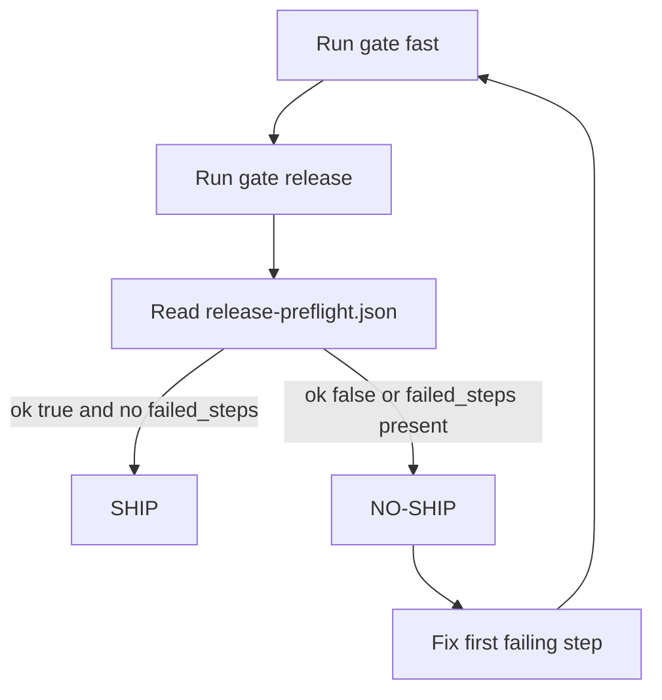

<div align="center">
  
  <h1>DevS69 SDETKit</h1>
  <p><strong>Release-confidence CLI for deterministic ship / no-ship decisions.</strong></p>
  <p>Same command path from local to CI, with machine-readable evidence artifacts.</p>
</div>

<hr />

<h2>📦 Full Product Surface</h2>

<table>
  <tr>
    <td width="33%" align="center">
      <a href="docs/start-here-5-minutes.md"></a><br/>
      <strong>Start Here</strong><br/>
      5-minute onboarding path
    </td>
    <td width="33%" align="center">
      <a href="docs/recommended-ci-flow.md"></a><br/>
      <strong>CI Rollout</strong><br/>
      Local-to-CI confidence lane
    </td>
    <td width="33%" align="center">
      <a href="docs/ci-artifact-walkthrough.md"></a><br/>
      <strong>Artifact Decoder</strong><br/>
      Understand pass/fail outputs
    </td>
  </tr>
  <tr>
    <td width="33%" align="center">
      <a href="docs/why-sdetkit-for-teams.md"></a><br/>
      <strong>For Teams</strong><br/>
      Shared operator model
    </td>
    <td width="33%" align="center">
      <a href="docs/release-confidence-roi.md"></a><br/>
      <strong>ROI</strong><br/>
      Confidence economics
    </td>
    <td width="33%" align="center">
      <a href="docs/index.md"></a><br/>
      <strong>Docs Hub</strong><br/>
      All guides in one place
    </td>
  </tr>
</table>

<hr />

<h2>🚀 Quickstart (Canonical)</h2>

```bash
python -m venv .venv
source .venv/bin/activate
python -m pip install -U pip
python -m pip install sdetkit==1.0.3

python -m sdetkit gate fast --format json --stable-json --out build/gate-fast.json
python -m sdetkit gate release --format json --out build/release-preflight.json
python -m sdetkit doctor
```

<h3>Expected artifacts</h3>

```text
build/
├── gate-fast.json
└── release-preflight.json
```

<table>
  <tr>
    <td><strong>Decision Contract</strong></td>
    <td><code>ok: true</code> in both artifacts → <strong>SHIP</strong></td>
  </tr>
  <tr>
    <td><strong>Block Condition</strong></td>
    <td><code>ok: false</code> or <code>failed_steps</code> present → <strong>NO-SHIP</strong></td>
  </tr>
</table>

<hr />

<h2>🧭 Operator Lanes</h2>

<h3>1) Release gate lane</h3>

```bash
python -m sdetkit gate fast
python -m sdetkit gate release
python -m sdetkit doctor
```

<h3>2) Review lane</h3>

```bash
python -m sdetkit review . --no-workspace --format json
python -m sdetkit review . --no-workspace --format operator-json
```

```bash
python -m sdetkit review . --no-workspace --format json | jq '{status, severity, findings: (.top_matters | length)}'
python -m sdetkit review . --no-workspace --format operator-json | jq '{status: .situation.status, severity: .situation.severity, now_actions: (.actions.now | length)}'
```

<h3>3) Health + quality lane</h3>

```bash
python -m pip install -r requirements-test.txt
PYTHONPATH=src python -m sdetkit.test_bootstrap_contract --strict
PYTHONPATH=src python -m sdetkit.test_bootstrap_validate --strict
./ci.sh quick --artifact-dir .sdetkit/out
make merge-ready
PYTHONPATH=src pytest -q
bash quality.sh cov
ruff check .
mutmut results
```

<hr />

<h2>🔁 Visual decision flow</h2>



<hr />

<h2>📊 Coverage policy (current)</h2>

<table>
  <tr>
    <td><strong>Previous baseline</strong></td>
    <td>fail-under <code>80</code></td>
  </tr>
  <tr>
    <td><strong>Current default</strong></td>
    <td><code>COV_MODE=standard</code> (fail-under <code>85</code>)</td>
  </tr>
  <tr>
    <td><strong>Compatibility mode</strong></td>
    <td><code>COV_FAIL_UNDER=80 bash quality.sh cov</code></td>
  </tr>
  <tr>
    <td><strong>Strict target</strong></td>
    <td><code>COV_MODE=strict</code> (fail-under <code>95</code>) by <strong>July 1, 2026</strong></td>
  </tr>
</table>

<hr />

<h2>🧱 Project shape</h2>

```text
src/sdetkit/   # product code + CLI
tests/         # automated tests
docs/          # user and maintainer docs
examples/      # runnable examples
scripts/       # repo helper scripts
.sdetkit/      # local generated outputs
artifacts/     # generated evidence packs
```

<hr />

<h2>📚 Full documentation map</h2>

<table>
  <tr>
    <td><a href="docs/start-here-5-minutes.md">Start in 5 minutes</a></td>
    <td><a href="docs/blank-repo-to-value-60-seconds.md">Blank repo to value in 60 seconds</a></td>
  </tr>
  <tr>
    <td><a href="docs/recommended-ci-flow.md">Recommended CI flow</a></td>
    <td><a href="docs/ci-artifact-walkthrough.md">CI artifact walkthrough</a></td>
  </tr>
  <tr>
    <td><a href="docs/why-sdetkit-for-teams.md">Why SDETKit for teams</a></td>
    <td><a href="docs/use-cases.md">Use cases</a></td>
  </tr>
  <tr>
    <td><a href="docs/release-confidence-roi.md">Release confidence ROI</a></td>
    <td><a href="docs/adoption-proof-examples.md">Adoption proof examples</a></td>
  </tr>
  <tr>
    <td><a href="docs/real-repo-adoption.md">Real repo adoption</a></td>
    <td><a href="docs/test-bootstrap.md">Test bootstrap playbook</a></td>
  </tr>
  <tr>
    <td><a href="docs/index.md">Docs hub</a></td>
    <td><a href="CONTRIBUTING.md">Contributing</a></td>
  </tr>
</table>

<hr />

<div align="center">
  <p><strong>DevS69 SDETKit</strong> — deterministic release confidence, with proof artifacts you can trust.</p>
</div>
