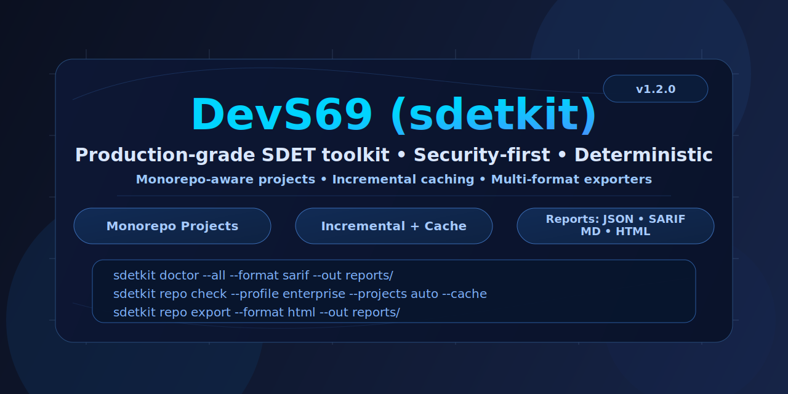
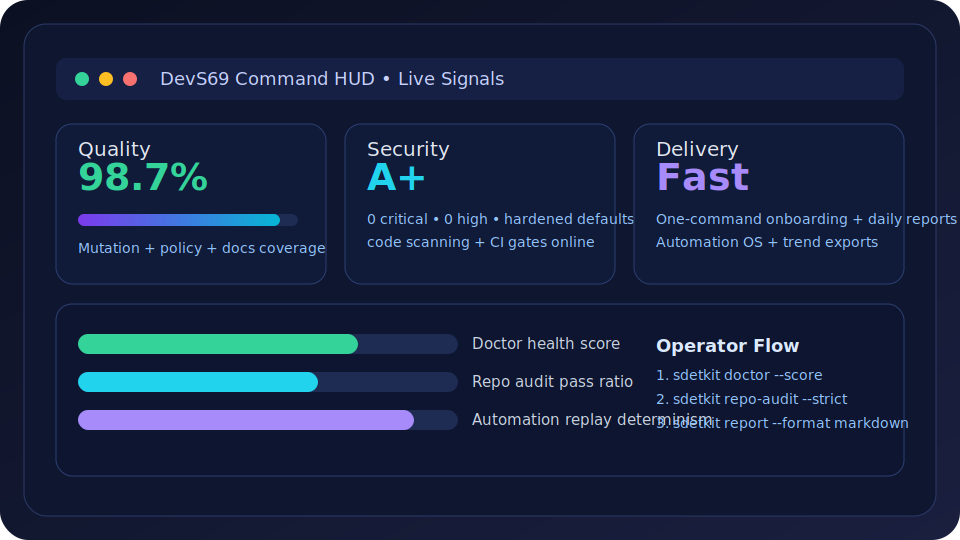
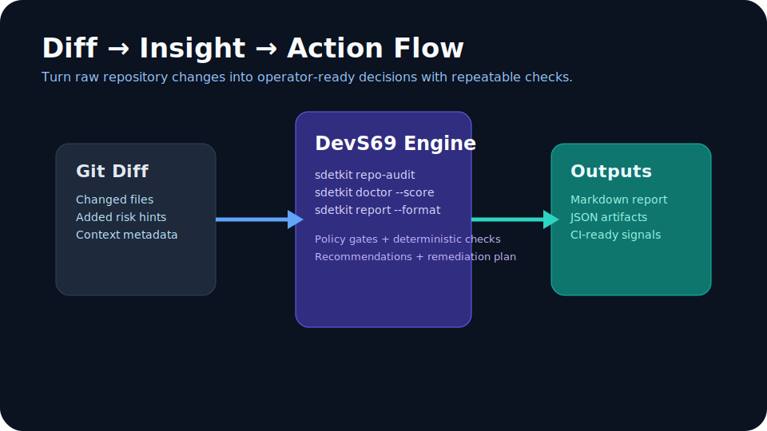
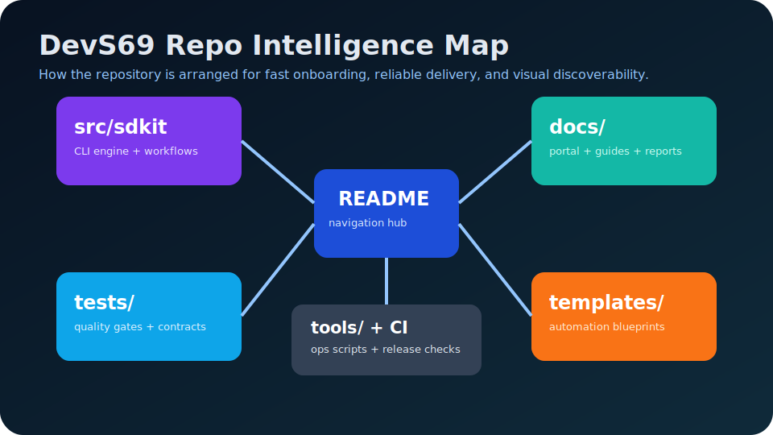

<div align="center">
  
  <h1>DevS69 SDETKit</h1>
  <p><strong>Deterministic release confidence for ship / no-ship decisions.</strong></p>
  <p>Run one operator workflow from laptop to CI and produce machine-readable evidence for every release call.</p>
  <p>
    <a href="docs/start-here-5-minutes.md"><strong>Start in 5 minutes</strong></a>
    ·
    <a href="docs/recommended-ci-flow.md"><strong>Roll out in CI</strong></a>
    ·
    <a href="docs/ci-artifact-walkthrough.md"><strong>Decode artifacts</strong></a>
  </p>
</div>

<p align="center">
  
</p>

---

DevS69 SDETKit is a **release-confidence CLI** for deterministic ship/no-ship decisions with machine-readable evidence.

**Primary outcome:** know if a change is ready to ship.

**Canonical first path:**
- `python -m sdetkit gate fast`
- `python -m sdetkit gate release`
- `python -m sdetkit doctor`

## Why teams use SDETKit

<table>
  <tr>
    <td width="33%" valign="top">
      <h3>🧭 Deterministic decisions</h3>
      <p>Every run resolves to a clear contract: <strong>SHIP</strong> or <strong>NO-SHIP</strong>.</p>
    </td>
    <td width="33%" valign="top">
      <h3>📦 Evidence, not opinion</h3>
      <p>Artifacts are JSON-first and auditable by humans, bots, and CI systems.</p>
    </td>
    <td width="33%" valign="top">
      <h3>⚙️ Same path everywhere</h3>
      <p>The same commands work locally, in pull requests, and in release pipelines.</p>
    </td>
  </tr>
</table>

---

## Product surface

<p align="center"><strong>Choose a lane and move fast.</strong></p>

<table>
  <tr>
    <td width="33%" align="center" valign="top">
      <a href="docs/start-here-5-minutes.md"></a>
      <p><a href="docs/start-here-5-minutes.md"><strong>Start Here →</strong></a><br/><sub>5-minute onboarding</sub></p>
    </td>
    <td width="33%" align="center" valign="top">
      <a href="docs/recommended-ci-flow.md"></a>
      <p><a href="docs/recommended-ci-flow.md"><strong>CI Rollout →</strong></a><br/><sub>Local-to-CI deployment lane</sub></p>
    </td>
    <td width="33%" align="center" valign="top">
      <a href="docs/ci-artifact-walkthrough.md"></a>
      <p><a href="docs/ci-artifact-walkthrough.md"><strong>Artifact Decoder →</strong></a><br/><sub>Understand every pass/fail signal</sub></p>
    </td>
  </tr>
  <tr>
    <td width="33%" align="center" valign="top">
      <a href="docs/why-sdetkit-for-teams.md"></a>
      <p><a href="docs/why-sdetkit-for-teams.md"><strong>For Teams →</strong></a><br/><sub>Shared operator model</sub></p>
    </td>
    <td width="33%" align="center" valign="top">
      <a href="docs/release-confidence-roi.md"></a>
      <p><a href="docs/release-confidence-roi.md"><strong>ROI →</strong></a><br/><sub>Confidence economics</sub></p>
    </td>
    <td width="33%" align="center" valign="top">
      <a href="docs/index.md"></a>
      <p><a href="docs/index.md"><strong>Docs Hub →</strong></a><br/><sub>Full documentation map</sub></p>
    </td>
  </tr>
</table>

---

## Operator quickstart (canonical)

```bash
python -m venv .venv
source .venv/bin/activate
python -m pip install -U pip
python -m pip install sdetkit==1.0.3

python -m sdetkit gate fast --format json --stable-json --out build/gate-fast.json
python -m sdetkit gate release --format json --out build/release-preflight.json
python -m sdetkit doctor
```

### Generated evidence artifacts

```text
build/
├── gate-fast.json
└── release-preflight.json
```

### Ship / no-ship decision contract

| Signal | Interpretation | Decision |
|---|---|---|
| `gate-fast.json.ok == true` and `release-preflight.json.ok == true` | All required checks passed | ✅ **SHIP** |
| Any `ok: false` | A gate failed | ❌ **NO-SHIP** |
| `failed_steps` present in either artifact | Explicit failed release criteria | ❌ **NO-SHIP** |

---

## Choose your lane

### 1) Release gate lane (pre-merge / pre-release)

```bash
python -m sdetkit gate fast
python -m sdetkit gate release
python -m sdetkit doctor
```

### 2) Review lane (operator + machine output)

```bash
python -m sdetkit review . --no-workspace --format json
python -m sdetkit review . --no-workspace --format operator-json
```

```bash
python -m sdetkit review . --no-workspace --format json | jq '{status, severity, findings: (.top_matters | length)}'
python -m sdetkit review . --no-workspace --format operator-json | jq '{status: .situation.status, severity: .situation.severity, now_actions: (.actions.now | length)}'
```

### 3) Health + quality lane

```bash
python -m pip install -r requirements-test.txt
PYTHONPATH=src python -m sdetkit.test_bootstrap_contract --strict
PYTHONPATH=src python -m sdetkit.test_bootstrap_validate --strict
./ci.sh quick --artifact-dir .sdetkit/out
make merge-ready
PYTHONPATH=src pytest -q
bash quality.sh cov
ruff check .
mutmut results
```


### 4) Impact workflow map (3 execution lanes aligned to phases 1→6)

```bash
python -m sdetkit doctor --format json --out build/doctor.json
python -m sdetkit gate fast --format json --stable-json --out build/gate-fast.json
python -m sdetkit gate release --format json > build/release-preflight.json || true
python scripts/impact_workflow_map.py
```

Outputs:
- `build/impact-workflow-map.json` (machine-readable impact workflow definition)
- `build/impact-workflow-map.md` (operator checklist for execution lane A/B/C)

Run the implementation workflow (execution engine):

```bash
python scripts/impact_workflow_run.py --step all --dry-run --format json --out build/impact-workflow-run.json
```

Run only lane A (`step_1`) with measurable accomplishment and phase-readiness output:

```bash
python scripts/impact_workflow_run.py --step step_1 --format json --out build/impact-step1-progress.json
```

Run lane B (`step_2`) with measurable accomplishment and phase-readiness output:

```bash
python scripts/impact_workflow_run.py --step step_2 --format json --out build/impact-step2-progress.json
```

Run boost mode (recommended for your next pass) and always generate follow-up:

```bash
python scripts/impact_workflow_run.py --step all --boost --format json --out build/impact-workflow-run.json --follow-up-out build/impact-follow-up.md --next-plan-out build/impact-next-plan.json --adaptive-review-out build/impact-adaptive-review.json --intelligence-db build/impact-intelligence.db
```

Boost outputs:
- `build/impact-follow-up.md` (human follow-up summary)
- `build/impact-next-plan.json` (machine action queue: immediate / upcoming / backlog)
- `build/impact-adaptive-review.json` (adaptive reviewer with 5 intelligence heads)
- `build/impact-intelligence.db` (database history for trend intelligence)
- `build/impact-criteria-report.json` (adaptive+agent+database criteria alignment report)
- `build/impact-trend-alert.json` (trend regression detector from intelligence DB)
- `build/impact-step1-scorecard.json` (phase 1-2 achievement percentage + status)
- `build/impact-program-scorecard.json` (lane A/B/C and overall program achievement)
- `build/impact-step-scorecards.json` (detailed phase-track achievements for `step_1`/`step_2`/`step_3`)

---

Policy config:
- `config/impact_policy.json` tunes trend-alert sensitivity (overall regression, per-head drop threshold, and minimum lane/program score thresholds), with branch overrides (e.g., stricter `main`, lighter `feature/*`).

Release-grade promotion guard (not just ad-hoc output):

```bash
python scripts/impact_release_guard.py --build-dir build --out build/impact-release-guard.json --format json
```

Guard output:
- `build/impact-release-guard.json` (final release-ready vs blocked contract)

---

CI automation:
- `.github/workflows/impact-release-control.yml` validates policy, runs the workflow + release guard, builds `build/impact-step1-scorecard.json` and `build/impact-step-scorecards.json`, renders `build/impact-pr-comment.md` (with status emoji, score delta, 3-run streak, weakest-head runbook, phase 1-2 achievement, phase 3-4 achievement, and phase 5-6 achievement), publishes it to GitHub Step Summary, and upserts a PR comment on every pull request.


## SDETKit vs ad-hoc release checks

| Capability | SDETKit | Ad-hoc scripts/manual checks |
|---|---|---|
| Deterministic ship/no-ship contract | ✅ First-class | ⚠️ Usually implicit |
| Machine-readable release artifacts | ✅ JSON artifacts by default | ⚠️ Inconsistent |
| Same workflow local + CI | ✅ Built-in | ⚠️ Often diverges |
| Operator review outputs | ✅ `json` + `operator-json` lanes | ❌ Rare |
| Fast diagnosis for blocked releases | ✅ `doctor` + `failed_steps` | ⚠️ Manual triage |

---

## Coverage policy

| Policy level | Command | Threshold |
|---|---|---|
| Standard (default) | `COV_MODE=standard` | `fail-under 85` |
| Compatibility mode | `COV_FAIL_UNDER=80 bash quality.sh cov` | `fail-under 80` |
| Strict target (by July 1, 2026) | `COV_MODE=strict` | `fail-under 95` |

---

## Repository map

```text
src/sdetkit/   # product code + CLI
tests/         # automated tests
docs/          # user and maintainer docs
examples/      # runnable examples
scripts/       # repo helper scripts
.sdetkit/      # local generated outputs
artifacts/     # generated evidence packs
```

---

## Documentation map

<table>
  <tr>
    <td><a href="docs/start-here-5-minutes.md">Start in 5 minutes</a></td>
    <td><a href="docs/blank-repo-to-value-60-seconds.md">Blank repo to value in 60 seconds</a></td>
  </tr>
  <tr>
    <td><a href="docs/recommended-ci-flow.md">Recommended CI flow</a></td>
    <td><a href="docs/ci-artifact-walkthrough.md">CI artifact walkthrough</a></td>
  </tr>
  <tr>
    <td><a href="docs/why-sdetkit-for-teams.md">Why SDETKit for teams</a></td>
    <td><a href="docs/use-cases.md">Use cases</a></td>
  </tr>
  <tr>
    <td><a href="docs/release-confidence-roi.md">Release confidence ROI</a></td>
    <td><a href="docs/adoption-proof-examples.md">Adoption proof examples</a></td>
  </tr>
  <tr>
    <td><a href="docs/real-repo-adoption.md">Real repo adoption</a></td>
    <td><a href="docs/test-bootstrap.md">Test bootstrap playbook</a></td>
  </tr>
  <tr>
    <td><a href="docs/index.md">Docs hub</a></td>
    <td><a href="CONTRIBUTING.md">Contributing</a></td>
  </tr>
</table>

---

## Top-tier reporting sample pipeline

Generate a portfolio-ready reporting sample with:

```bash
make top-tier-reporting
```

See:
- `docs/portfolio-reporting-recipe.md`
- `docs/kpi-schema.md`

---

## Historical and transition-era references (secondary)

These references remain available for compatibility and ongoing teams, but are intentionally secondary to first-time adoption.

---

<div align="center">
  <strong>DevS69 SDETKit</strong><br/>
  Deterministic release confidence, with artifacts you can trust.
</div>
