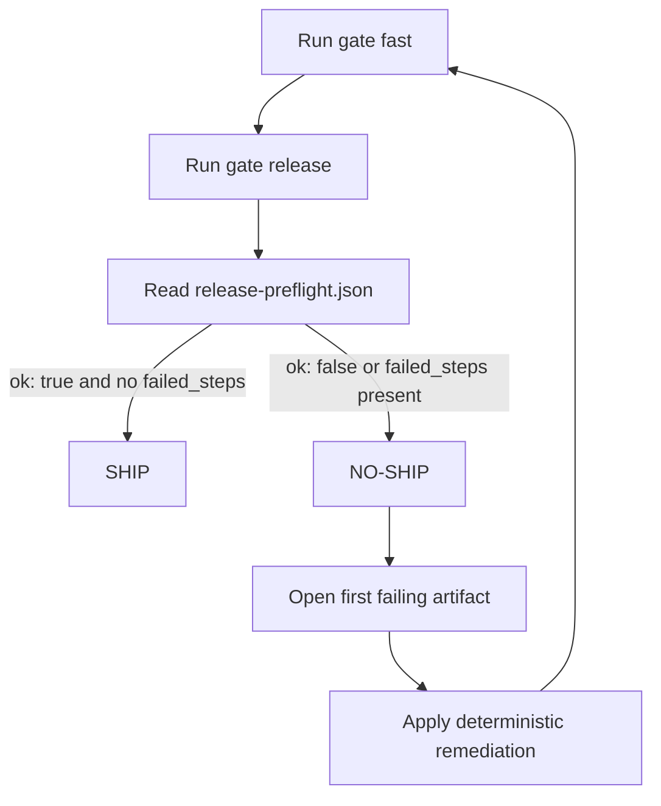

# DevS69 SDETKit


Primary outcome: know if a change is ready to ship.

Canonical first path:
- `python -m sdetkit gate fast`
- `python -m sdetkit gate release`
- `python -m sdetkit doctor`


[](https://sherif69-sa.github.io/DevS69-sdetkit/)
[](https://github.com/sherif69-sa/DevS69-sdetkit/actions/workflows/ci.yml)
[](https://github.com/sherif69-sa/DevS69-sdetkit/commits/main)
[](https://github.com/sherif69-sa/DevS69-sdetkit/releases)
[](https://github.com/sherif69-sa/DevS69-sdetkit/issues)
[](CONTRIBUTING.md)

DevS69 SDETKit is a release-confidence CLI: it gives engineering teams deterministic ship/no-ship decisions with machine-readable evidence, using one repeatable command path from local to CI.

**Primary outcome:** know in minutes if a change is ready to ship.

**Fast path:** [Live HUD](https://sherif69-sa.github.io/DevS69-sdetkit/command-hud-live/) · [Quickstart](#quickstart) · [CI rollout](docs/recommended-ci-flow.md)

## Live product visualization

[](https://sherif69-sa.github.io/DevS69-sdetkit/command-hud-live/)

- Live HUD page: <https://sherif69-sa.github.io/DevS69-sdetkit/command-hud-live/>
- HUD card asset: <https://sherif69-sa.github.io/DevS69-sdetkit/assets/devs69-card-hud.svg>

## Live + auto-updated signals

These pull directly from GitHub and auto-update whenever workflows, releases, or the default branch changes.

- **Pages**: deployment/live website state
- **CI**: workflow status on `main`
- **Last commit**: latest default-branch push
- **Latest release**: newest tagged release
- **Open issues**: active backlog signal

## Why people star SDETKit

- ✅ One clear release decision: **ship / no-ship**
- ✅ Same commands locally and in CI
- ✅ JSON artifacts that make triage faster

## Quickstart

Install and run:

```bash
python -m venv .venv
source .venv/bin/activate
python -m pip install -U pip
python -m pip install sdetkit==1.0.3

python -m sdetkit gate fast --format json --stable-json --out build/gate-fast.json
python -m sdetkit gate release --format json --out build/release-preflight.json
python -m sdetkit doctor
```

Expected output:

```text
build/
├── gate-fast.json
└── release-preflight.json
```

Decision:
- `ok: true` in both artifacts -> **ship**
- `ok: false` and/or `failed_steps` present -> **no-ship**, fix first failing step and rerun

## Use cases

- PR readiness with objective evidence
- Release room confidence checks
- CI gate policies with machine-readable contracts

## Give it a free look

- Open the live HUD: <https://sherif69-sa.github.io/DevS69-sdetkit/command-hud-live/>
- Try the quickstart above
- If it helps, ⭐ star the repo

## Proof of value (live log)

Want proof before investing time? See the ongoing evidence log:

- [`docs/proof-log.md`](docs/proof-log.md) — real pass/fail outcomes, fixes, and cycle-time notes
- [Open a Value proof report](https://github.com/sherif69-sa/DevS69-sdetkit/issues/new?template=value_proof_report.yml) — share your result with one structured issue
- [Value proof reporting guide](docs/value-proof-reporting.md) — 1-minute guide for high-quality reports
- [14-day proof sprint checklist](docs/proof-sprint-checklist.md) — run the upcoming execution loop day-by-day
- [Day 1 proof starter](docs/day1-proof-starter.md) — copy/paste first run if you’re unsure where to begin
- Adaptive reviewer mode: include `judgment_summary` + confidence in proof reports when available

## Advanced details (optional)

<details>
<summary>Show decision flow, operator details, and artifact examples</summary>

### Visual decision flow (local + CI)



### Example release artifact shape

```json
{
  "ok": false,
  "failed_steps": ["gate_fast"],
  "profile": "release"
}
```

</details>

## Where to go next

- Start here in 5 minutes: [`docs/start-here-5-minutes.md`](docs/start-here-5-minutes.md)
- Blank repo to value in 60 seconds: [`docs/blank-repo-to-value-60-seconds.md`](docs/blank-repo-to-value-60-seconds.md)
- CI rollout path: [`docs/recommended-ci-flow.md`](docs/recommended-ci-flow.md)
- Artifact decoder: [`docs/ci-artifact-walkthrough.md`](docs/ci-artifact-walkthrough.md)

<details>
<summary>More docs</summary>

- Team overview: [`docs/why-sdetkit-for-teams.md`](docs/why-sdetkit-for-teams.md)
- Team use cases: [`docs/use-cases.md`](docs/use-cases.md)
- Release confidence ROI: [`docs/release-confidence-roi.md`](docs/release-confidence-roi.md)
- Adoption-proof examples: [`docs/adoption-proof-examples.md`](docs/adoption-proof-examples.md)
- Community growth playbook: [`docs/community-growth-playbook.md`](docs/community-growth-playbook.md)
- Docs hub: [`docs/index.md`](docs/index.md)

</details>

## Canonical local-to-CI journey

The same first-path commands should run locally and in CI so teams make release decisions from consistent evidence contracts.

For a reproducible first-run acceptance proof in a fresh repo:

```bash
python -m pytest -q tests/test_external_first_run_contract.py
```

Context: [`docs/real-repo-adoption.md`](docs/real-repo-adoption.md)

## Review command format quick guide (operator adoption)

Use `sdetkit review` when you need one front-door decision pass over doctor/inspect/compare/project/history.

- Use `--format json` when you need the **full review payload** (deep debugging, custom analytics, or internal tooling that consumes all sections).
- Use `--format operator-json` when you need the **stable operator-facing integration contract** for CI jobs, dashboards, and operator automations.
- For operator integrations, prefer `operator-json` as the long-lived parsing surface.

Short deterministic examples:

```bash
python -m sdetkit review . --no-workspace --format json
python -m sdetkit review . --no-workspace --format operator-json
```

Practical machine-consumption examples:

```bash
# Full payload: inspect status + top-level counts for deeper triage scripts
python -m sdetkit review . --no-workspace --format json | jq '{status, severity, findings: (.top_matters | length)}'

# Stable operator contract: gate on operator-facing situation/actions fields
python -m sdetkit review . --no-workspace --format operator-json | jq '{status: .situation.status, severity: .situation.severity, now_actions: (.actions.now | length)}'
```

## Secondary surfaces (after canonical confidence path)

These remain available and supported after the core release-confidence lane is trusted, but they are intentionally not the front-door recommendation.

### Extended repo lanes

```bash
make bootstrap
bash quality.sh ci
python -m sdetkit kits list
python -m sdetkit legacy list
python -m sdetkit legacy <historical-command>
python -m sdetkit --help --show-hidden
```

### Repo health snapshot

```bash
python -m pip install -r requirements-test.txt
# tests require Python >= 3.11
PYTHONPATH=src python -m sdetkit.test_bootstrap_contract --strict
PYTHONPATH=src python -m sdetkit.test_bootstrap_validate --strict
# optional CI-style evidence outputs:
./ci.sh quick --artifact-dir .sdetkit/out
make merge-ready
PYTHONPATH=src pytest -q
bash quality.sh cov
ruff check .
mutmut results
```

For a focused preflight playbook (checks, artifact outputs, exit codes), see [`docs/test-bootstrap.md`](docs/test-bootstrap.md).

### Coverage hardening migration (staged)

- **Previous default:** `bash quality.sh cov` used `COV_FAIL_UNDER=80` when unset.
- **New default (effective now):** `bash quality.sh cov` uses `COV_MODE=standard` (fail-under `85`).
- **Temporary compatibility override:** `COV_FAIL_UNDER=80 bash quality.sh cov` (or `COV_MODE=legacy bash quality.sh cov`).
- **Stricter enforcement target:** use `COV_MODE=strict` (fail-under `95`) for merge/release truth lanes by **July 1, 2026**.

### Project layout

```text
src/sdetkit/   # product code + CLI
tests/         # automated tests
docs/          # user and maintainer docs
examples/      # runnable examples
scripts/       # repo helper scripts
.sdetkit/      # local generated outputs
artifacts/     # generated evidence packs
```

## Documentation and references

- Docs hub: [`docs/index.md`](docs/index.md)
- Architecture quick map for contributors: [`ARCHITECTURE.md`](ARCHITECTURE.md)
- Contributing: [`CONTRIBUTING.md`](CONTRIBUTING.md)
- Support and issue routing: [`SUPPORT.md`](SUPPORT.md)
- Release process: [`RELEASE.md`](RELEASE.md)
- Git workflow (branch tracking + ahead/behind): [`docs/git-workflow.md`](docs/git-workflow.md)
- Enterprise readiness audit: [`docs/enterprise-readiness-audit-2026-04.md`](docs/enterprise-readiness-audit-2026-04.md)

### Historical and transition-era references (secondary)

- Compare against ad hoc workflows: [`docs/sdetkit-vs-ad-hoc.md`](docs/sdetkit-vs-ad-hoc.md)
- Repo hygiene boundaries: [`docs/repo-cleanup-plan.md`](docs/repo-cleanup-plan.md)
- Ongoing repo status view: [`docs/repo-health-dashboard.md`](docs/repo-health-dashboard.md)
- Historical archive index: [`docs/archive/index.md`](docs/archive/index.md)

## Top-tier reporting sample pipeline

Run `make top-tier-reporting` to generate a deterministic sample bundle and promotion artifacts.

- Recipe: [`docs/portfolio-reporting-recipe.md`](docs/portfolio-reporting-recipe.md)
- KPI schema: [`docs/kpi-schema.md`](docs/kpi-schema.md)
